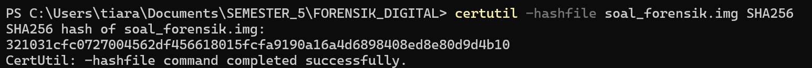
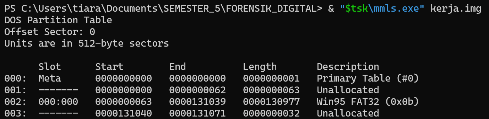
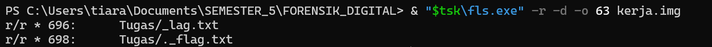
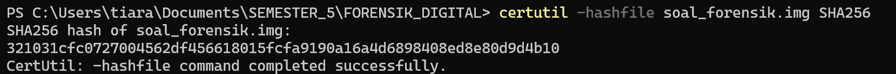

# Write-Up Tantangan Forensik Digital Kelompok 1: Flag di File Terhapus

**Skenario Kasus:** Barang bukti berupa 1 *flashdisk* (62,0 GB, FAT32, skema partisi MBR, label volume `FORENSIK`). Tujuan investigasi adalah menemukan 1 *flag* tersembunyi berformat `F0RD1G{...}`. Aturan utamanya adalah **integritas barang bukti**: flashdisk asli tidak boleh diubah, analisis hanya dilakukan pada *image*.

---

### Tahap 1: Verifikasi Integritas Image Barang Bukti

Image forensik (`soal_forensik.img`) dibuat dari flashdisk secara sektor demi sektor menggunakan `dd`, lalu dikemas menjadi `soal_forensik.zip`. Sebelum dianalisis, image diekstrak dan hash SHA-256-nya dicek untuk memastikan file tidak korup atau berubah.

```
certutil -hashfile soal_forensik.img SHA256
```

**Hash SHA-256:** `321031cfc0727004562df456618015fcfa9190a16a4d6898408ed8e80d9d4b10`



### Tahap 2: Kunci Master & Buat Salinan Kerja

Image master dikunci *read-only*, dan seluruh analisis dilakukan pada salinannya agar barang bukti asli tetap utuh.

```
attrib +r soal_forensik.img
copy soal_forensik.img kerja.img
```


### Tahap 3: Analisis Tabel Partisi (mmls)

Tabel partisi dibaca dengan `mmls` untuk mengetahui letak partisi FAT32.

```
mmls.exe kerja.img
```

| Slot | Start | End | Length | Description |
|------|-------|-----|--------|-------------|
| 002 | 63 | 131039 | 130977 | Win95 FAT32 (0x0b) |

**Temuan:** Partisi FAT32 dimulai pada sektor **63**, sehingga `OFFSET = 63`.



### Tahap 4: Penelusuran File Terhapus (fls)

File system ditelusuri secara rekursif dan hanya menampilkan entri yang sudah dihapus (`-d`).

```
fls.exe -r -d -o 63 kerja.img
```

Hasil:

```
r/r * 696:      Tugas/_lag.txt
r/r * 698:      Tugas/._flag.txt
```

**Temuan:**
- Tanda `*` berarti file sudah dihapus.
- `_lag.txt` (inode **696**) adalah file yang namanya kepotong. Pada FAT, penghapusan mengganti karakter pertama nama file dengan penanda hapus, sehingga huruf pertama hilang dan terbaca `_`.
- `._flag.txt` (inode 698) adalah file metadata bawaan macOS (AppleDouble). Entri ini mengonfirmasi bahwa nama asli file adalah `flag.txt`.



### Tahap 5: Pemulihan Isi File (icat)

Isi file dipulihkan langsung lewat nomor inode, tanpa perlu nama filenya.

```
icat.exe -o 63 kerja.img 696
```


### Tahap 6: Verifikasi Integritas Akhir

Hash image master dihitung ulang dan hasilnya sama dengan hash di Tahap 1, artinya barang bukti tidak berubah selama analisis.

```
certutil -hashfile soal_forensik.img SHA256
```



---

### Kesimpulan & Flag

File yang dihapus di FAT tetap bisa dipulihkan karena yang dihapus hanya **entri direktorinya**, sedangkan isi data di cluster tetap ada sampai tertimpa data baru. Karena itu, menyalin folder secara biasa tidak akan menemukan flag ini, sementara analisis pada image forensik bisa.

**FLAG RECOVERED:** `F0RD1G{w0w_congr4t5_d4p3t_fl44444ggg_}`

---

### Tools

- Sleuth Kit 4.15.0 (`mmls`, `fls`, `icat`), Windows build
- `certutil` (Windows) untuk hash SHA-256
- `dd` (pembuatan image, dikerjakan di macOS)